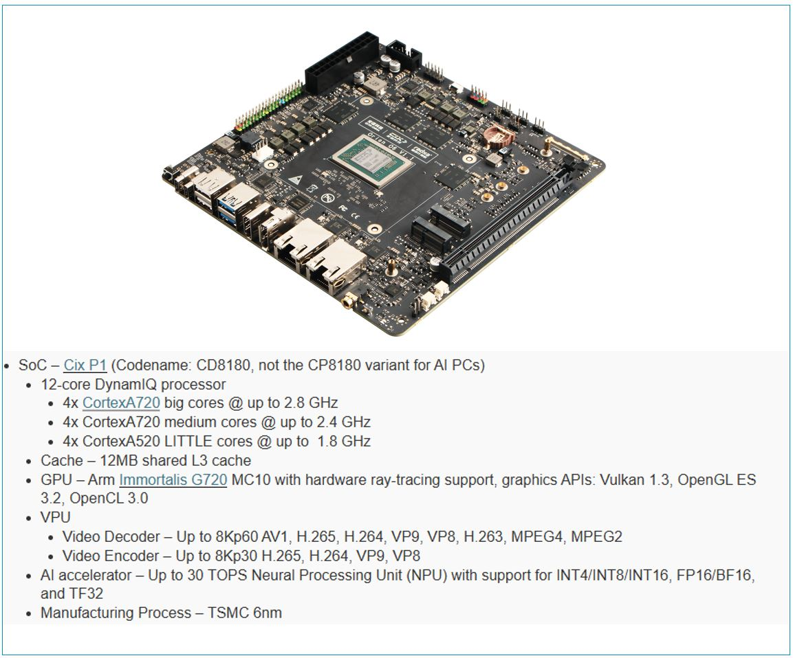

# Tutorial 0: Background

Radxa Orion6 ready to dev and end-users:

- ARM China Zhouyi NPU (X2_1204)
- High End CPU
- Up 64GB DDR4
- Low power
- Very attractive for developers and geeks

This tutorial is offered to assist developers in utilizing the NPU on the Radxa Orion6.