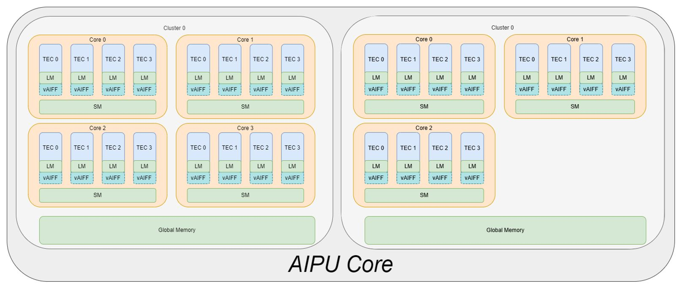

# Tutorial 1: Zhouyi NPU Architecture
Currently, Zhouyi NPUs have released several generations of processors based on the Zhouyi architecture. This document focus on the **Zhouyi X2_1204** NPU.

**Zhouyi X2_1204 NPU**

The Zhouyi NPU introduces an extensible **multi-cluster** and **multi-core** architecture.


**Cix AIPU Arch** 
Cix AIPU has 1 cluster with 3 Core per cluster.It has 4 TECs and 1 AIFF per core.
- 3 Cores
- 4 TECs per core
- 1 AIFF per core


**Cluster**
The Zhouyi NPU can be configured as multiple clusters. Each cluster may include multiple cores for
different tasks execution in parallel.

- **Global Memory** (GM) works as scratchpad memory for all NPU cores inside a cluster.

**Core**
Each cluster can be configured as a single core or multiple cores.

- **Shared memory** works for all TECs inside a core. Shared memory has a fixed address entry for all TECs and asynchronized units to access.
- **AIFF** works as a major fixed operation accelerated data processing unit. AIFF can accept different requests from TECs and return execution results and status to each TEC.
- **L1 D-Cache** is the shared data cache for all TECs inside a core. It enables multiple TECs to fetch data at the same time, and it also supports AIFF/DMA instruction dispatch.
- **L1 I-Cache** is the instruction cache unit. It fetches instructions for the fetch unit. It enables multiple TECs to fetch requests at the same time and returns instructions to the fetch unit. The instructions are from either I-Cache memory or external memory.
- **Direct Memory Access (DMA)**: Each TEC has a dedicated DMA channel to send requests from the TEC to the DMA unit. The DMA unit is responsible for data movement across different memory space. DMA accepts different requests from TECs and returns execution results and status to each TEC.

**TEC**
A TEC acts as an independent programmable unit for data processing and flow control with 256 bit vector processor.

- **Local Memory (LM)**: Each TEC has internal local memory which is only accessible by each TEC.
- **Scalar Processing Unit (SPU)**: For scalar computing and control-flow.
- **Vector/Tensor Processing Engine (VPE)**: For vector/tensor processing.
- **Floating-point Processing Unit (FPU)**: For scalar and vector floating-point computing.

```{note}
    TEC supports INT8/INT16/INT32/FP16/BF16

    AIFF supports INT8/INT16
```


