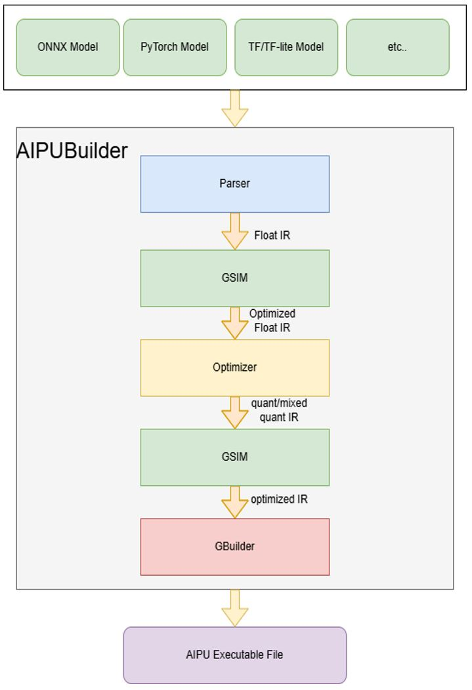
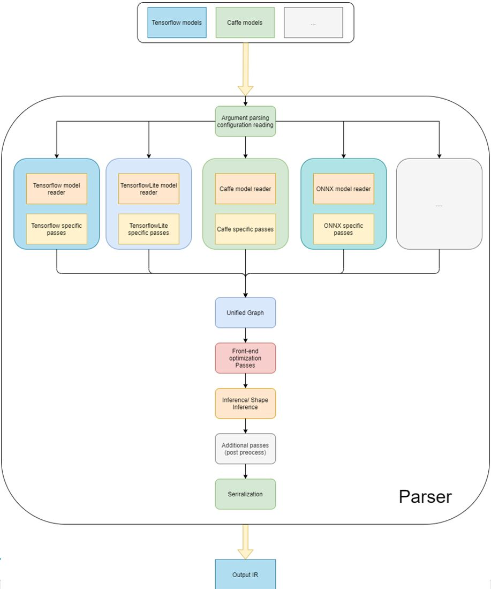
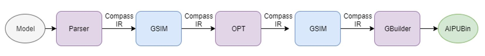
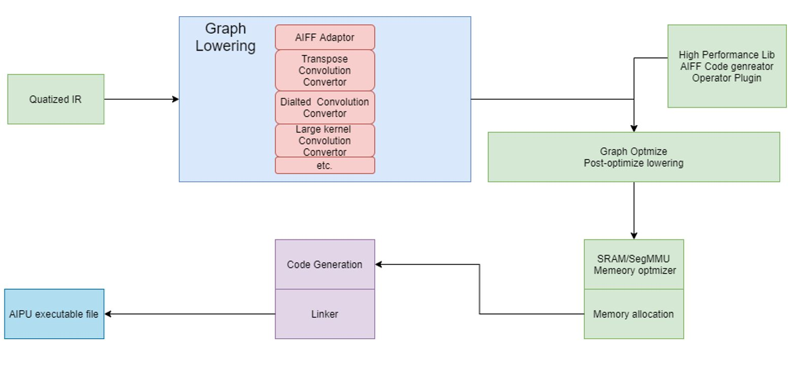

# Tutorial 2: AIPUBuilder Overview

The AIPUBuilder is the AI compiler to build from the NN model to AIPU binary executable file.

It includes the following components:
- **Parser**: support Pytorch  Tensorflow Tensorflow-lite ONNX  models
- **GSim**: hign level graph optimizer
- **OPT**: quantization tool
    - support auto quantization
    - accuracy evaluation
    - quantization
- **GBuilder**:
    - Graph compiler
    - support multi-target
    - memory allocation & optimization

## Parser

Parser has multiple front-end to parse different framework models.
- Support:
    - TensorFlow 
    - ONNX
    - TensorFlow Lite
- Unified internal graph
- Front-end pass optimization

- github link: https://github.com/Arm-China/Compass_Unified_Parser

## GSim

GSIM is a IR to IR tool, supports float IR, quant IR or mixed IR.

GSIM also will act as intermediate stage between Parser/OPT/GBuilder.

Support:
- Constant folding
- Common subexpression elimination(CSE) 
- Fusing and elimination Ops

## OPT
OPT is our quantization tool.

- Calibration:
    - Get Min/Max for each layer by small batch of data
    - Quantize with min/max of each layer
    - symmetric and asymmetric quantization
    - Int8/int16/fp16 mix quantization
    - Support K-L divergent or absolute min/max calibration 

- Float32 forward and accuracy estimate
- Int8/int16 forward  and accuracy estimate
- github link: https://github.com/Arm-China/Compass_Optimizer

## Gbuilder
GraphBuilder(GBuilder) is the core NN compiler to build from the NN IR to AIPU binary code.

- **Graph Lowering**: transforms high-level IR into machine-specific libraries or code.
- **Graph Optimization**: 
    - fuse block of ops to reduce overhead of itermediate data movement.
    - auto-select the best library implementation for each operation.
- **Operator Plugin**: integrate built-in high-performance TEC/AIFF libraries.
- **SRAM optimizer**: memory allocation optimizer. A specific allocator to using internal/external SRAM.
- **Code Generator**: code generator and linker produce the final executable code.

