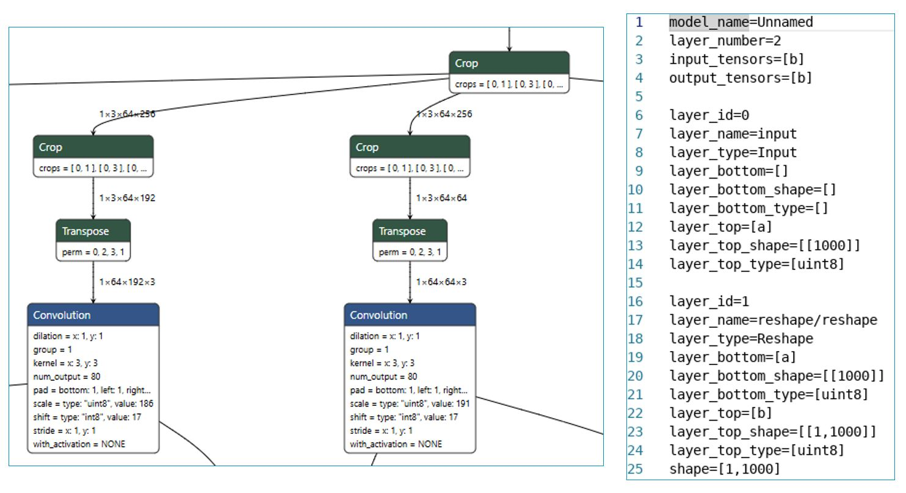

# Tutorial 3: Compass IR Overview

Compass IR defines the operations inside the NN model. It contains info includes:
- model name
- layer number
- input tensor, output tensor
- each layer info:
    - layer id
    - layer name
    - layer type
    - bottom and top tensor(shape,layout, dtype, ...)
    - quantization info (scale, shift, ...)

Parsing the NN model from ONNX/Pytorch/TensorlowLite, we can obtain: 
- A txt file, so call the IR definition for model (compass_ir.txt)
- A .bin binary file for weight data (weight.bin)

Compass IR is compatible with Netron, you can inspect the structure of our Compass IR by using [Netron](https://neo-vincent.github.io/netron/source/index.html).

