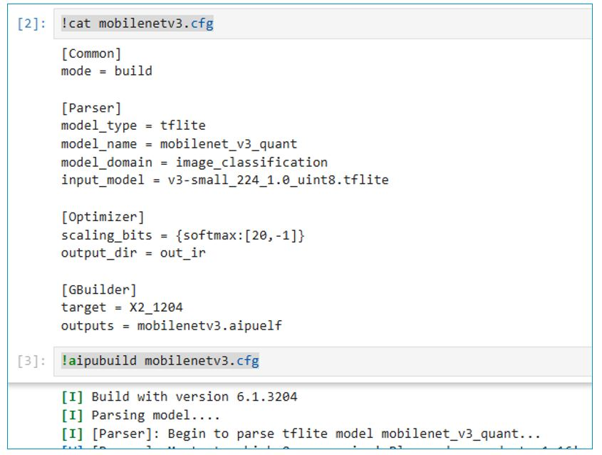
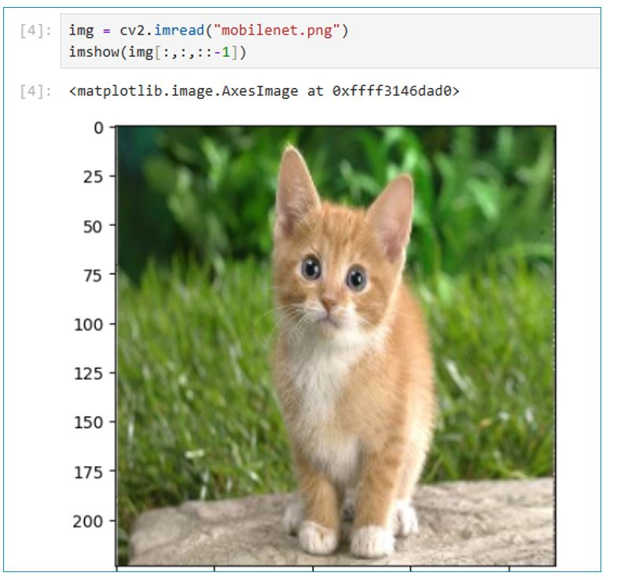
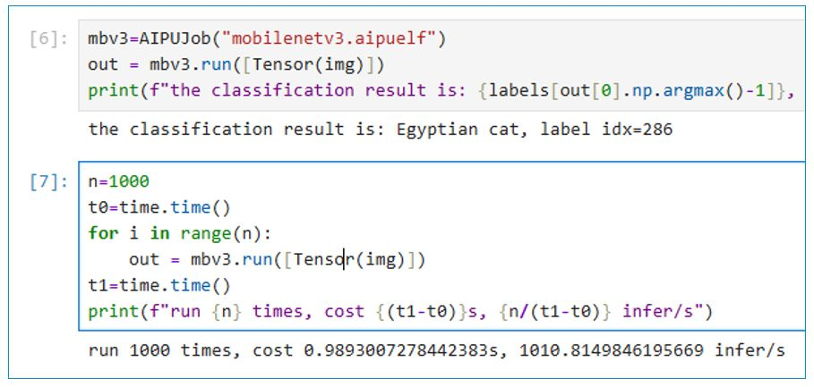

# Tutorial 5: Run a demo MobileNetV3

In this tutorial, we will show you how to run a demo MobileNetV3 on Zhouyi NPU.


## 1. Download model
You can download the model from this link: https://storage.googleapis.com/mobilenet_v3/checkpoints/v3-small_224_1.0_uint8.tgz
This is a quantized TFLite model.

## 2. Config
```
# mobilenetv3.cfg file
[Common]
mode = build

[Parser]
model_type = tflite
model_name = mobilenet_v3_quant
model_domain = image_classification
input_model = v3-small_224_1.0_uint8.tflite

[Optimizer]
scaling_bits = {softmax:[20, -1]}
output_dir = out_ir

[GBuilder]
target = X2_1204
outputs = mobilenetv3.aipuelf
```

## 3. Build
```bash
aipubuild mobilenetv3.cfg
```
This will build from the tflite model into aipu executable file.


## 4. Run AIPUModel
Now we can load the `mobilenetv3.aipuelf` and run with a test image.



You can test the performance by repeatly running n times and get the average time.



### 5. Other Tips
- Using quantized models with ONNX and TFLite, you don’t need to prepare quantization data.
- Small models work well with single-core X2_1204. For large models, use multi-core X2_1204MP3 as the target.
- Multi-core models require enabling tiling=fps to achieve performance improvement from multiple cores.
- Save the intermediate generated IR for easier debugging and performance tuning later. Example: output_dir = path/to/save
- Install Graphviz to visualize the model structure during the Gbuilder phase. Example formats: svg=graph.svg or png=graph.png
- Use Netron to view the original model and intermediate IR.