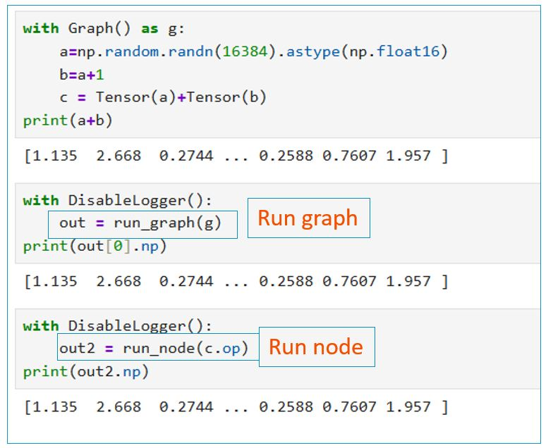
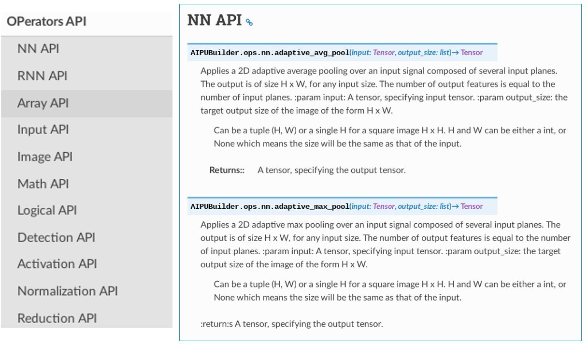
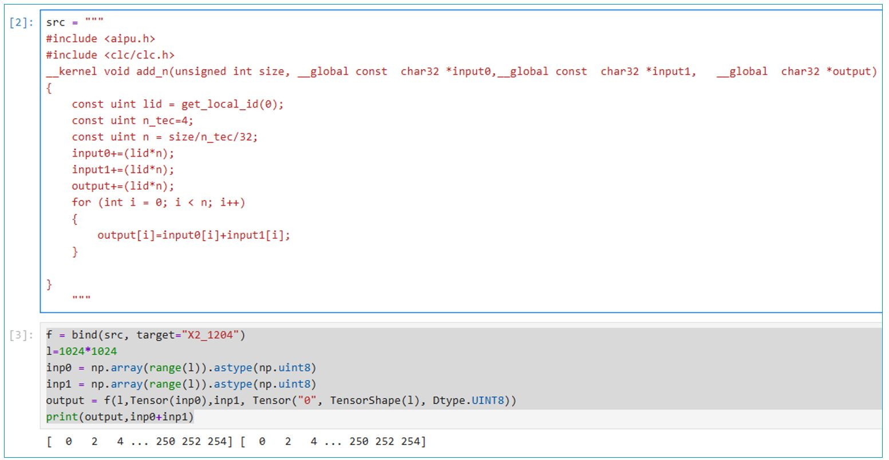
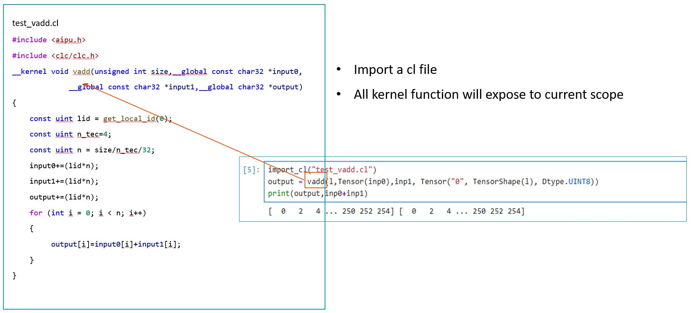

# Tutorial 7: AIPUBuilder Python API

## Tool Level API
As mentioned in last tutorial, the AIPUBuilder provides the following tools:
- LLVM toolchain: aipuoas, aipuocc, aipuold
- NN toolchain: aipuparser, aipugsim, aipuopt, aipugb, ...

These are command line tools the can directly use in terminal.
All tools are wrapped with a python function with sys.argv as arguments.
```python
aipubuild() aipuparser() aipugsim() aipuopt() aipurun() aipugb() aipuocc(), aipuold(), aipuoas()
```
You can run this tool with `-h` to get help message
```bash
aipuxxx -h 
```
## Device API
You can understand device API as driver API.
- `AIPUModel`: read a binary model file and parse model related info.
- `AIPUJob`: base on AIPUModel to create a job, prepare memory and data, then launch the job.
- getter API: get the AIPU config and status info
    - `get_cluster_number()`
    - `get_core_number()`
    - `get_cur_freq()`
    - `get_device_status()`
    - `get_device_version()`

## Execution API
This two APIs will build and run a graph/node directly on AIPU. The build model weill be cached if you run the same graph several times.
- `run_graph()`
- `run_node()`
You can use `with DisableLogger():` to disable the compile-time log.



## Operators(Ops) API
AIPUBuilder provide a set of API to create node(Op)
- support both float/quant ops
- auto quantization supported
- well documented ops API


Here we show two simple ops API as example:
1. ops.image_resize
Here we read the image using opencv, then call the `ops.image_resize()` to resize the image, with bilinear resize method.

2. profiling
We provide profiling api. After running the graph, you can call `graph.perf` to see the profiling data:



## Bind API
The Bind APIs are designed for OpenCL programming. With OpenCL, you can write the kernel function for a particular operator without worrying about the host code. AIPUBuilder will handle all the other tasks, allowing you focus on kernel programming. This approach is beneficial for quickly prototyping a new operator.

The Bind API is tightly binding with numpy, which is good for result verification. The bind API are designed for user friendly.

Here is the first example, you can directly bind a OpenCL kernel function, run and get results.



You can also import a opencl file, and all kernel functions will expose to current scope. You can then call your kernel function directly using the kernel_name in OpenCL function.

