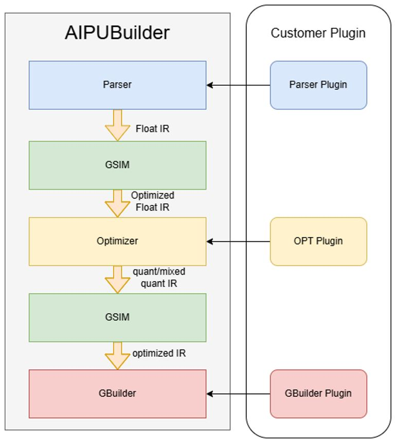
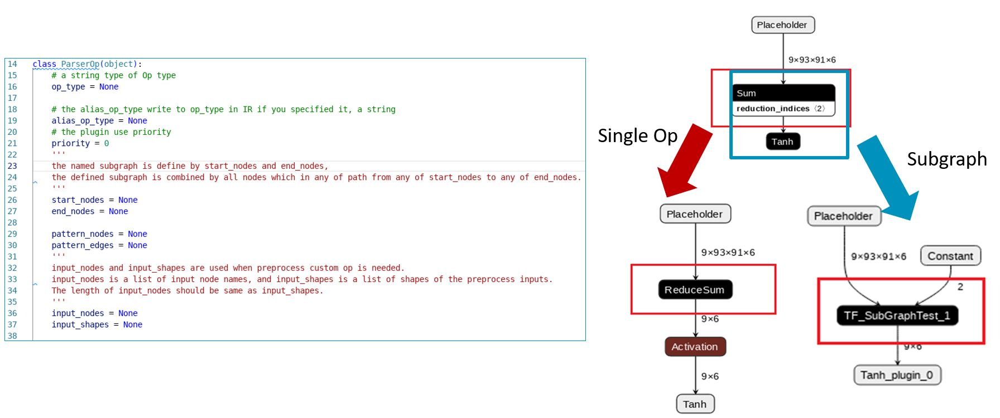

# Tutorial 8: AIPUBuilder Plugin

## AIPUBuilder Plugin Overview

AIPUBuilder provides plugin mechanism for custom operator extend.
- Parser Plugin
- OPT Plugin
- GBuilder Plugin



### Plugin Search PATH
- Environment variable: AIPUPLUGIN_PATH
- Current working directory: `.` and  `./plugin/`

### Plugin naming conventions:
- Starts with “aipubt_”
- For builder plugin, we recommend starts with “aipubt_builder_”
- For parser plugin, we recommend starts with “aipubt_parser_”
- For OPT plugin, we recommend starts with “aipubt_opt_”


## Parser Plugin
Parser is opensource: https://github.com/Arm-China/Compass_Unified_Parser.git

.. note::

    If you meet no supported Operator, please create an issue/PR

- SingleOp Plugin: Convert an un-supported op to customized op
- Subgraph Plugin: Convert a subgraph to a customized op



## OPT Plugin
OPT is opensource: https://github.com/Arm-China/Compass_Optimizer.git 

```{note}
    If you meet no supported Operator, please create an issue/PR
```

- DataSet Plugin: self-defined dataset  for calibration and validation
    - Subclass of `torch.utils.dataset`
    - Need implement `__init__`, `__len__`, `__getitem__`
    - Built-in over 32 dataset plugins
- Metric Plugin: for getting “accuracy” for quantization with customized metric
- Operator plugin: for quantization of single op

## GBuilder Plugin 
Gbuilder Plugin is for running customized code in NPU

Implement your plugin
- Inherit from base class BuilderOpPlugin
- Register the plugin: @register_plugin(PluginType.Builder,0) 

Implement related method
- get_graph_pattern: get the pattern of the plugin
- generate_params: generate the parameters for the kernel function
- set_target(optional): which target you want to support
- check_params(optional)
- setup(optional)
- generate_kernel(optional):  use the first kernel function if not specified
- get_score(optional)

Implement one of the three function for code:
- generate_code: a string of the source code
- genreate_code_file: a cl source code path
- generate_code_name: a compiled object file path

